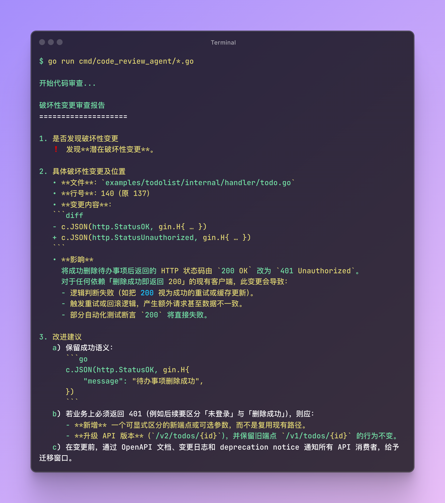

# Code Review Agent

🤖 一个基于AI的智能代码审查工具，专门用于检测代码变更中的破坏性变更（Breaking Changes）。

## 📋 项目简介

Code Review Agent 是一个自动化代码审查工具，它能够：
- 自动检测Git仓库中未提交的代码变更
- 识别可能导致向后兼容性问题的破坏性变更
- 提供详细的审查报告和改进建议
- 帮助开发团队维护代码库的稳定性

## ✨ 功能特性

- 🔍 **智能检测**：基于AI模型分析代码变更，识别破坏性变更
- 📊 **详细报告**：提供具体的问题位置和代码引用
- 💡 **改进建议**：针对发现的问题提供实用的修复建议
- 🚀 **实时流式输出**：支持实时查看审查进度和结果
- 🔧 **易于集成**：可轻松集成到现有的开发工作流中



## 🎯 检测范围

- 函数签名变更
- 接口定义修改
- 公共类和方法的变更
- API契约破坏
- 数据结构变更
- 配置文件格式变更

## 🛠️ 安装要求

- Go 1.25+
- Git（用于获取代码变更）
- Moonshot API访问权限

## ⚙️ 环境配置

### 环境变量

在使用前，请设置以下环境变量：

```bash
# 必需的环境变量
export MOONSHOT_API_KEY="sk-********************"

# 可选的环境变量
export MOONSHOT_MODEL_NAME="kimi-k2-0711-preview"  # 默认使用配置的模型
export MOONSHOT_BASE_URL="https://api.moonshot.cn/v1"  # 默认Moonshot官方API
```

## 🚀 使用方法

### 基本使用

```bash
# 克隆项目
git clone https://github.com/suica/codereview-agent
cd codereview-agent

# 运行代码审查
go run ./cmd/code_review_agent/*.go
```

### 工作流程

1. 在你的项目目录中进行代码修改
2. **不要**提交到暂存区（不要执行 `git add`）
3. 运行代码审查工具
4. 查看审查结果和改进建议

### 示例输出

```
[流式渲染输出开始]
审查结果：
发现破坏性变更：
- 文件：example.go
  - 函数：PublicFunction
    - 原参数列表：PublicFunction(a, b string)
    - 新参数列表：PublicFunction(a, b, c string)

改进建议：
- 如果新参数c是可选的，建议使用默认值，例如：PublicFunction(a, b, c string) 改为 PublicFunction(a, b string, options ...string)
- 考虑创建新的函数版本，保持原函数不变以维持向后兼容性
[流式渲染输出结束]
```

## 🏗️ 项目结构

```
codereview-agent/
├── cmd/
│   └── code_review_agent/
│       ├── main.go          # 主程序入口
│       └── prompts.go       # AI提示词配置
├── examples/
│   └── todolist/           # 示例项目
├── go.mod                  # Go模块依赖
├── go.sum                  # 依赖校验文件
└── README.md              # 项目文档
```

## 🔧 核心组件

### AI模型集成
- 基于 [CloudWeGo Eino](https://github.com/cloudwego/eino) 框架
- 支持Moonshot AI模型
- 可配置的模型参数和API端点

### Git集成
- 自动检测未暂存的代码变更
- 支持多种文件类型的差异分析
- 智能过滤无关变更

### 流式输出
- 实时显示审查进度
- 支持大型代码库的增量处理
- 优化的用户体验

## ⚙️ 配置说明

### 自定义提示词

可以通过修改 `prompts.go` 文件来自定义AI审查的行为和输出格式。

### 模型配置

支持配置不同的Moonshot模型和参数：
- 模型选择（moonshot-v1-8k、moonshot-v1-32k等）
- 温度参数调节
- 自定义API端点

## 🤝 贡献指南

1. Fork 本仓库
2. 创建特性分支 (`git checkout -b feature/AmazingFeature`)
3. 提交变更 (`git commit -m 'Add some AmazingFeature'`)
4. 推送到分支 (`git push origin feature/AmazingFeature`)
5. 开启 Pull Request

## 📄 许可证

本项目采用 Apache License 2.0 许可证。详情请参阅 [LICENSE](LICENSE) 文件。

## ⚠️ 注意事项

- 确保在Git仓库目录中运行工具
- 工具仅分析未暂存的变更，已提交的代码不会被检测
- 建议在重要变更前使用此工具进行预检查
- AI分析结果仅供参考，最终决策需要人工判断

## 🔗 相关链接

- [CloudWeGo Eino](https://github.com/cloudwego/eino) - AI应用开发框架
- [Moonshot AI](https://platform.moonshot.cn/docs) - AI模型API文档

## 📞 支持

如果您遇到问题或有建议，请：
- 提交 [Issue](../../issues)
- 参与 [Discussions](../../discussions)
- 查看项目文档

---

**让AI帮助您维护更稳定的代码库！** 🚀